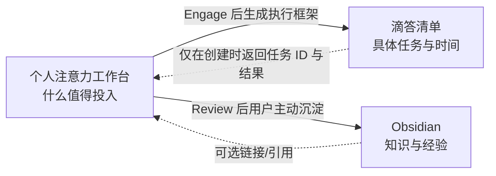
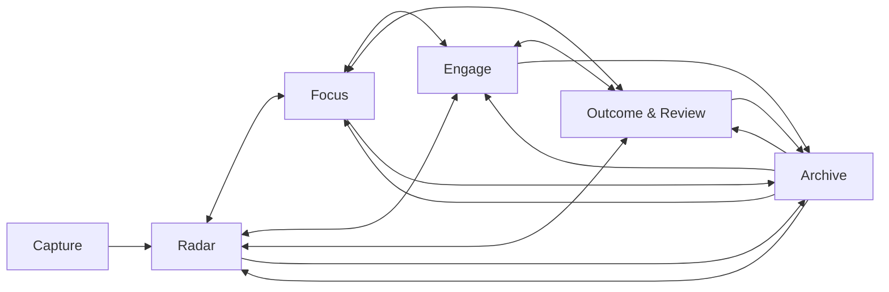

# 个人注意力工作台：项目需求与产品设计文档

> 文档类型：PRD + 产品设计规格  
> 版本：1.2  
> 日期：2026-08-21  
> 产品阶段：Phase 1 非 AI 核心工作台；Phase 2 AI 增强  
> 核心命题：What deserves my attention?

> **2026-08-21 已确认调整**：卡片不再记录投入时间；进入 Engage 时可选择仅移入或同时发起滴答创建；类别改为六类固定体系；洞察展示当前阶段分布和图标化当前关注领域。涉及冲突时，以 `docs/superpowers/specs/2026-08-21-attention-workbench-interaction-categories-design.md` 为准。

## 0. 执行摘要

个人注意力工作台不是新的知识库，也不是新的任务管理器。它填补 Obsidian 与滴答清单之间的空白：在大量兴趣、想法、可能性与项目之间，帮助用户决定什么值得进入当前注意力范围，什么值得被承诺执行，以及何时应该暂停、放弃或归档。

三个系统的职责必须保持单一且清晰：

- **Obsidian**：沉淀知识、观点、经验与长期可复用内容，回答“我知道了什么”。
- **滴答清单**：管理具体任务、子任务、时间与完成状态，回答“我要做什么、何时做”。
- **个人注意力工作台**：管理注意力组合、承诺与流转，回答“什么值得我现在投入”。

工作台的三个一级板块为：

- **探索**：想学习、理解或经历的对象，如知识、概念、书、电影、课程、活动和体验。
- **创造**：想做出、表达或组织的对象，如软件、硬件、写作、研究、课程或活动策划。
- **洞察**：观察注意力分布、流动、投入、停滞与产出，并支持每周重新配置注意力。

探索与创造使用同一个注意力生命周期，但在类别、结果与 AI 拆解方式上有所区别。产品不以“收集了多少”为成功，而以是否减少无意识承诺、是否形成稳定的选择—投入—复盘闭环为成功。

**最终建议**：值得继续开发，但应采用“先做纵向薄切、再补齐 Phase 1”的路线。首个可用切片只实现 Capture、可直接拖拽的看板、WIP、Weekly Attention Review、Aging/Stalled 和 JSON 备份；随后再补基础洞察、导入和进入 Engage 时的一次性滴答任务创建。运行 4–6 周并确认它确实改变选择行为，再进入 AI。飞书多维表格适合导入旧数据或快速验证，不适合作为长期核心界面；纯 AI 对话助手也不适合替代可扫描、可复盘的工作台。

## 1. 项目背景与问题定义

### 1.1 当前处境

用户的兴趣、概念、书影音、活动、项目与写作想法分散在飞书、Obsidian 和滴答清单中。表面问题是信息分散、缺少聚合和统计；更深层的问题是：

1. 记录下来的对象越来越多，但它们是否值得继续投入并不清楚。
2. “可能感兴趣”容易被误当成“已经承诺”，造成心理负债。
3. 输入、实践、创造与复盘之间缺少连续的流转记录。
4. 现有工具分别擅长知识和任务，却没有工具专门管理注意力组合。
5. 缺少固定 Review 仪式，系统容易退化为另一个静态数据库。

### 1.2 真正要解决的问题

本项目解决的不是“把所有东西放到一个页面”，而是以下决策问题：

- 哪些对象只需要留在 Radar，暂时不占用当前注意力？
- 哪些对象反复出现或与当下方向高度相关，应该进入 Focus？
- 在容量有限时，哪些对象值得确认进入 Engage？
- 新承诺进入时，应该替换、暂停或放弃什么？
- 投入之后发生了什么，是否形成了理解、经历、作品或新的问题？
- 最近的注意力实际流向哪里，是否与用户想要的方向一致？

### 1.3 产品定义

> 一个帮助个人把大量兴趣与想法从 Radar 中筛选出少量 Focus，再从中作出少量执行承诺，并通过 Review 持续调整注意力组合的工作台。

它管理的是**可能性、注意力和承诺**，不是所有资料与所有任务。

## 2. 方案比较与产品路线决策

### 2.1 可选路线

| 路线 | 优点 | 主要局限 | 结论 |
|---|---|---|---|
| 飞书多维表格直接实现 | 上手快、已有数据容易迁移、适合两周行为实验 | Engage 入口规则、全局 WIP、阶段事件、异常恢复与 AI 体验受限 | 适合验证和导入，不作为长期核心产品 |
| 独立响应式 Web/PWA | 可完整实现看板、门槛、Review、跨端与集成；后续扩展空间最好 | 初始开发成本更高，需要处理账号、同步和部署 | **推荐作为正式产品路线** |
| 飞书作数据库 + 自定义前端 | 初期似乎兼顾速度与定制 | 双重权限、同步和平台依赖反而增加复杂度 | 不推荐 |
| 纯 AI 对话式工作台 | 捕获和分析自然，属于 AI 时代的新路径 | 不利于快速扫描组合、比较 WIP、追踪状态和完成严谨 Review | 作为 Phase 2 入口，不替代主界面 |

### 2.2 路线决策

采用独立响应式 Web/PWA。Phase 1 优先验证注意力模型本身，不先做复杂 AI、全平台聚合或重型自动化。高级洞察的优先级低于 Weekly Attention Review，因为“看数据”不能替代“做决定”。

推荐先用 4–6 周真实运行判断产品是否成立。满足以下条件后再扩大投入：

- 用户能在 30 秒内说清当前 Focus 与 Engage 是什么。
- 至少完成 4 次 Weekly Attention Review。
- 至少有一个对象完成 Radar → Focus → Engage → Outcome & Review → Archive 的闭环。
- 新增 Engage 确实伴随替换、暂停或容量判断，而不是无限加码。
- 进入 Engage 时能在滴答中一次性创建任务，不需要在两个系统持续维护同一批任务。

## 3. 产品目标与非目标

### 3.1 产品目标

1. 建立从发现到承诺、从投入到复盘的统一注意力生命周期。
2. 用全局 WIP 显性呈现机会成本，限制同时关注和推进的对象数量。
3. 让探索与创造可以相互衍生，同时保留它们之间的来源关系。
4. 让 Engage 能稳定、可追踪地向滴答清单一次性创建任务，同时避免重复创建。
5. 用事件历史支持漏斗、转化、Aging、停滞和组合分析。
6. 通过 Weekly Attention Review 把工作台变成决策行为，而不是展示页面。
7. 在 Phase 2 让 AI 发现模式、提供证据和拆解框架，但不替用户作人生决定。

### 3.2 非目标

- 不替代 Obsidian 的笔记编辑、双链、检索或长期知识管理。
- 不替代滴答清单的 GTD、日程、提醒、优先级和日常任务管理。
- 不把所有工作义务、零散 Todo 和日历事件导入工作台。
- 不建立完整的资料收藏、文件存储或全文阅读系统。
- 不在 Phase 1 自动抓取所有旧平台内容；迁移以一次性导入和人工筛选为主。
- 不让 AI 自动移动卡片、Drop、Archive，或在无确认时向滴答创建任务。
- 不做团队协作、项目预算、工时结算或企业级权限。
- 不用“新增条目数”“卡片总数”作为核心生产力指标。

## 4. 产品原则

1. **选少比收多重要**：系统必须帮助用户少做一些事。
2. **兴趣不等于承诺**：Radar 与 Focus 不进入滴答；只有 Engage 才进入执行系统。
3. **阶段清晰、交互简化**：Radar、Focus 等是状态；用户通过拖拽或“移动到”表达阶段变化，不需要学习另一套动作术语。
4. **一个对象模型，两个业务视图**：探索和创造共享生命周期与数据底座，避免重复实现。
5. **Review 先于 Dashboard**：决策流程优先于漂亮但不改变行为的数据展示。
6. **软限制但有代价**：WIP 可以调整或临时突破，但必须显性确认并留下记录。
7. **自由流转但不绕过关键门槛**：允许跳转，进入 Engage 必须完成一次轻量确认。
8. **AI 是顾问，不是经理**：提供证据、反例、候选方案与不确定性；最终动作由用户确认。
9. **单一事实来源**：注意力状态、执行状态和知识内容分别由工作台、滴答和 Obsidian 负责。
10. **可恢复优先**：Drop 不是删除；滴答创建失败可重试；创建结果可追踪。

## 5. 用户与核心场景

### 5.1 目标用户

V1 面向单一重度知识工作者：兴趣面广、持续产生项目和写作想法、已经使用 Obsidian 与滴答清单，并愿意每周进行一次注意力复盘。

### 5.2 核心场景

| 场景 | 用户目标 | 产品结果 |
|---|---|---|
| 快速捕获 | 先记下一个概念、书、电影或项目想法，不立即承诺 | 最少输入后进入对应板块的 Radar |
| 从 Radar 选择 | 判断反复出现或与近期方向相关的对象 | 拖到 Focus，并开始占用 Focus 容量 |
| 作出承诺 | 决定实际投入一个对象 | 确认进入 Engage；容量不足时明确机会成本 |
| 执行 | 在熟悉的工具中完成具体步骤 | 进入 Engage 时向滴答一次性创建任务；之后不在工作台重复维护 GTD |
| 完成与复盘 | 记录实际结果，并决定是否沉淀或衍生 | 进入 Outcome & Review，可导出 Obsidian 内容并衍生新卡片 |
| 停止投入 | 对价值不足、时机不对或不再感兴趣的对象停止关注 | Drop 后可恢复地退出活跃组合，不制造“失败清单” |
| 每周调整 | 重新审视 Radar、Focus、Engage 和停滞对象 | 完成 Weekly Attention Review，形成下周组合 |
| 观察模式 | 看最近关注什么、投入多少、哪里停滞 | 洞察页提供 Attention、Portfolio、Flow、Aging 四类证据 |

## 6. 信息架构与系统边界

### 6.1 一级与二级导航

一级导航固定为：

1. **探索**：探索类看板。
2. **创造**：创造类看板。
3. **洞察**：组合、流动、投入与停滞分析。

全局入口：

- 快速 Capture。
- Weekly Attention Review。
- 全局搜索与过滤。
- Archive。
- 设置与集成。

### 6.2 三个系统的职责

| 数据类型 | 唯一事实来源 | 其他系统的角色 |
|---|---|---|
| 板块、Stage、WIP、Drop、衍生卡片、Review 决策 | 注意力工作台 | 滴答和 Obsidian 不反向修改这些状态 |
| 任务、子任务、日期、提醒、完成状态 | 滴答清单 | 工作台只保存拆解方案和一次性创建回执，不回读完成状态 |
| 知识正文、观点、永久笔记、附件 | Obsidian | 工作台只保存链接或导出记录，不复制正文库 |

## 7. 核心概念

### 7.1 Attention Item

工作台中的最小管理对象，代表一个值得评估是否投入注意力的“可能性”。它可以是一本书、一个概念、一场活动、一篇文章想法或一个软件项目，但不是具体 Todo。

### 7.2 Board

- **探索（Explore）**：投入注意力的目的主要是理解、学习或经历。
- **创造（Create）**：投入注意力的目的主要是形成作品、方案、研究、产品或活动。

若只是最初分类错误，可直接更换板块并记录历史；若探索真正产生了新的创造目标，应使用“衍生卡片”，而不是把原卡片改成创造卡片。

### 7.3 Stage 与拖拽

阶段移动只要求用户理解五个 Stage：Radar、Focus、Engage、Outcome & Review、Archive。看板中不显示 Select、Commit、Promote、Demote、Reconsider、Reengage、Reactivate 等动作名；用户通过直接拖拽表达“把这张卡片移到哪个阶段”。Drop、Archive、移回看板和衍生卡片是少量具有独立结果的辅助操作。

程序内部同样不需要为每一种方向发明动词。所有阶段变化只保存统一的 `stage_changed` 事件及 `from_stage`、`to_stage`、时间、来源和 `transition_mode`。Drop、Archive、移回看板仍是用户可见操作，但分别记录为 `drop`、`archive`、`restore` 模式；衍生卡片因会创建新对象，保留独立事件。

### 7.4 Aging 与 Stalled

- **Stage Aging**：当前时间减去 Stage Entered At，表示在当前阶段停留了多久。
- **Inactive Aging**：当前时间减去 Last Touched，表示卡片多久没有任何有意义的动作，用于一般展示。
- **Stalled**：当前 Stage 对应的实质活动达到阈值。Radar/Focus 使用最近一次阶段移动、明确保留或说明更新；Engage 使用最近一次“记录进展/投入”，若尚无进展记录则使用进入 Engage 的时间。Stalled 是规则标签，不是新的 Stage。

### 7.5 Outcome & Review

这是离开主动投入后的复盘区，不只代表“产生作品”。探索对象可以以理解、看完、参加、试过或部分完成为结果；创造对象可以以原型、发布、交付、取消或部分完成为结果。

### 7.6 衍生卡片

从一张卡片衍生出新的独立 Attention Item，并保留来源关系。例如：

- 探索“AI 个性化教育” → 衍生创造“写一篇个性化变量框架文章”。
- 探索“Context Engineering” → 衍生创造“做一个上下文管理 Demo”。

## 8. 生命周期与状态机

### 8.1 生命周期

箭头代表用户直接拖拽或使用“移动到”菜单。进入 Focus/Engage 时检查相应 WIP；进入 Engage 时触发滴答创建流程，实际创建时机见 8.4。图中的双向箭头不代表两个不同业务动作。

### 8.2 状态定义

| 状态 | 含义 | 是否占 WIP | 是否进入滴答 | 典型退出条件 |
|---|---|---:|---:|---|
| Radar | 可能值得，以后再看；尚未进入当前关注组合 | 否 | 否 | 可拖到任何阶段或停止投入 |
| Focus | 当前值得认真关注，但尚未承诺执行 | 是，默认上限 10 | 否 | 可拖到任何阶段或停止投入 |
| Engage | 已明确承诺投入并需要实际行动 | 是，默认上限 4 | 按 Phase 1/2 规则一次性创建 | 可直接拖走；不操作已创建的滴答任务 |
| Outcome & Review | 已形成阶段性结果或需要复盘 | 否 | 否 | 可拖回看板其他阶段、归档或停止投入 |
| Archive | 已退出活跃组合，保留历史，可区分正常归档与 Drop | 否 | 否 | 使用“移回看板”选择目标阶段 |

### 8.3 用户可见操作

| 界面操作 | 结果 | 约束与记录 |
|---|---|---|
| Capture | 新卡片进入 Radar | 标题和板块必填；其他字段可选 |
| 拖拽/移动到 | 卡片进入目标 Stage | 记录统一 `stage_changed`；目标为 Focus/Engage 时检查 WIP |
| 停止投入（Drop） | 卡片进入 Archive | `stage_changed.transition_mode=drop`，保存可选原因；不物理删除 |
| 归档（Archive） | 卡片进入 Archive | `stage_changed.transition_mode=archive`；可从任意阶段使用 |
| 移回看板 | Archive → 用户选择的阶段 | `transition_mode=restore`；进入 Focus/Engage 时检查 WIP；界面不使用 Reactivate 一词 |
| 衍生卡片 | 原卡片不变，新卡片进入 Radar | 默认复制主题标签并保存来源关系 |

### 8.4 自由跳转规则

1. Radar、Focus、Engage、Outcome & Review 之间可以直接拖拽，不要求按相邻顺序流转。
2. 拖入 Focus 时检查 Focus WIP；拖入 Engage 时检查 Engage WIP，并触发滴答创建流程。Phase 1 仅在基础创建已启用时，于进入确认后创建父任务；Phase 2 在整套 AI 计划确认后创建任务组；未启用集成时只改变 Stage。
3. 从 Engage 拖走不需要“离场”或滴答处置确认，也不会修改、完成或删除已经创建的滴答任务；若目标为 Focus，仍执行目标 Stage 的 WIP 判断。可用一条非阻塞提示说明“滴答任务保持不变”。
4. 拖入 Archive 视为普通归档；若用户想表达明确的停止决定，使用“停止投入”。两者都可从 Archive 的“移回看板”恢复。
5. 所有阶段变化只记录 `from_stage → to_stage`，不伪造中间阶段；洞察仍可据此计算转化和跳级。
6. 第一次进入 Engage 自动触发相应 Phase 的创建流程，不等于未经确认立即写入。若该卡片已有创建回执，之后再次进入 Engage 不自动重复创建，而是让用户选择“打开已有任务”“重新创建一组”或“跳过”。

### 8.5 时间戳语义

- **入库时间**：首次 Capture 的时间，永不改变。
- **Stage Entered At**：最后一次进入当前 Stage 的时间；只有状态变化才更新。
- **Last Touched**：标题、说明或标签变更、阶段拖拽、完成 Review、手动记录进展/投入等有意义动作发生时更新；仅打开或浏览卡片不更新。
- 系统额外维护 `last_progress_at`，仅由“记录进展/投入”更新，供 Engage Stalled 判断；不依赖滴答回读。
- 完整阶段历史与活动历史由追加式事件保存，不能只依赖卡片当前时间戳。

## 9. 对象模型与字段

### 9.1 V1 卡片可见字段

核心字段保持精简，不设置结构化的 Why 和 Desired Outcome；用户可以在可选“说明”中自由记录相关想法。

| 字段 | 类型 | 必填 | 规则 |
|---|---|---:|---|
| 标题 | 短文本 | 是 | Capture 时唯一必填内容字段 |
| 说明 | Markdown 长文本 | 否 | 用于记录想法、背景、链接、阶段性思考；支持编辑/预览、自动保存和纯文本搜索 |
| 所属板块 | 枚举：探索/创造 | 是 | Capture 时必选；可纠正分类 |
| 类别标签 | 单选标签 | 否 | 不同板块使用不同候选值；允许设置中维护 |
| 主题标签 | 多选标签 | 否 | 跨板块共享，如 AI、教育、工程、写作 |
| 当前状态 | 枚举 | 自动 | Radar / Focus / Engage / Outcome & Review / Archive |
| 入库时间 | 时间 | 自动 | 首次 Capture 时间 |
| Stage Entered At | 时间 | 自动 | 最近进入当前状态的时间 |
| Last Touched | 时间 | 自动 | 最近一次有意义动作时间 |

建议初始类别：

- 探索：知识/概念、书、电影、课程、活动、体验、其他。
- 创造：软件、硬件、写作、研究、课程/教学、活动策划、其他。

### 9.2 系统字段与辅助对象

下列内容不增加卡片填写负担，但开发时必须保存：

| 对象 | 关键内容 | 作用 |
|---|---|---|
| Attention Item 内部字段 | ID、排序、版本号 | 唯一识别、并发保护和稳定展示 |
| Stage Change Event | item_id、from_stage、to_stage、transition_mode、可选原因、occurred_at、source、WIP 决策 | 统一记录普通移动、Drop、Archive 和移回看板，支持统计和审计 |
| Activity Event | 类型、occurred_at、来源、属性变更前后值 | 记录创建、衍生、说明编辑、明确保留和进展；只追加不覆盖 |
| Item Relation | parent_item_id、child_item_id、relation=spawned_from | 追踪探索与创造的衍生链 |
| Review Record | review_id、类型、开始/完成快照、时间、简短结果、投入时间、沉淀/衍生决策 | 支持 Outcome Review 与 Weekly Review；Review 内事件关联 review_id |
| Decomposition Plan | 版本、假设、步骤树、状态、生成来源 | Phase 2 保存 AI 框架，不塞进核心卡片字段 |
| TickTick Export Receipt | export_id、幂等键、目标清单、卡片/计划版本、请求快照、已创建任务 ID、状态、创建时间 | 证明一次性创建结果、提供深链并防止重复创建；不用于持续同步 |
| TickTick Export Item | export_item_id、export_id、父项、顺序、独立幂等键/恢复标记、请求快照、外部任务 ID、状态 | 每个父任务或步骤调用前先落库，支持逐项恢复，避免整批只靠一个状态 |
| Time Entry | 时长、关联卡片、开始/结束时间、备注 | 记录用户手动填写的实际投入 |
| WIP Configuration | Focus/Engage 上限、Aging 阈值 | 个性化容量和规则 |
| Attention Compass | 当前 1–3 个关注方向、时间范围、容量约束 | Phase 2 为 AI 提供全局判断背景，不是卡片字段 |

### 9.3 卡片表面信息

看板卡片只显示：标题、类别、最多两个主题标签、当前阶段停留时间、最后触达时间；“说明”只在详情中展示，可选显示两行摘要。Engage 卡片额外显示“滴答已创建/创建中/创建失败”状态。其他信息在详情抽屉中展示，避免卡片变成小型数据库。

## 10. 页面设计

### 10.1 全局框架

- 顶部：探索、创造、洞察。
- 固定快捷入口：`+ Capture`、`Weekly Review`、搜索。
- 右上：WIP 摘要 `Focus 8/10 · Engage 3/4`、Archive、设置。
- 桌面优先使用完整看板；移动端按 Stage 分组，支持横向切换与快速 Capture。

### 10.2 探索看板与创造看板

两个页面结构一致，减少学习成本。默认显示四列：Radar、Focus、Engage、Outcome & Review；Archive 通过独立入口查看。

每列包含：

- 当前数量；Focus/Engage 同时显示全局 WIP，而不是仅本板块数量。
- 排序：手动排序、最近触达、阶段 Aging、入库时间。
- 过滤：类别、主题、Aging、Stalled、滴答创建状态。
- 核心交互是拖拽；菜单只保留“移动到”“停止投入”“归档”“移回看板”“衍生卡片”。

空状态不鼓励“多添加”，而是解释该阶段的决策含义。

### 10.3 快速 Capture

默认交互：

1. 输入标题。
2. 选择探索或创造；记住上一次选择但清晰可见。
3. 说明、类别、主题标签可选；默认折叠，不增加快速捕获负担。
4. 保存后直接进入 Radar。

目标是移动端 10 秒内完成。Capture 不要求写理由、结果、任务或计划。

### 10.4 卡片详情抽屉

分为四个轻量区块：

1. **基本信息**：九个 V1 字段，其中说明支持 Markdown 编辑/预览、自动保存和安全渲染。
2. **流转历史**：阶段 from/to、时间、停留天数与跳级记录，不显示内部动作术语。
3. **执行关联**：仅 Engage 后出现，显示 AI/人工框架、滴答创建回执和“打开滴答任务”。
4. **Review 与衍生**：Outcome Review、Weekly Review 决策、Obsidian 链接与衍生关系。

Phase 1A 的 Engage 详情提供轻量“记录进展/投入”动作：可以只确认“今天有实质进展”，也可选填分钟数和一句备注。该动作写入 Activity Event，用于没有滴答集成时的执行活动时间；界面文案始终写“无已记录执行活动”，不声称用户现实中完全没有推进。

### 10.5 确认进入 Engage（内部规则名：Commitment Gate）

任何方式进入 Engage 都打开同一个门槛界面：

- 当前 Engage 组合及 `当前数量/上限`。
- 新卡片的标题、板块、类别和主题。
- 如果已满，优先提供“把哪张现有 Engage 移到 Radar/Focus”；其次才是“一次性超限”或“修改上限”；也可取消。
- Phase 1：仅在滴答基础创建已启用时，“确认进入 Engage”同时表示确认创建一个父任务；未启用时只移动卡片。
- Phase 2 AI 计划模式：第一次确认只移动卡片并生成完整框架；用户再对整套方案与外部写入做一次预览、编辑和确认，第二次确认前不得调用滴答。不逐个确认 Next Action。

### 10.6 Outcome & Review 页面

每张待 Review 卡片回答四件事：

1. 结果属于完成、部分完成、自然结束还是放弃。
2. 实际投入时间是多少；由用户手填或汇总工作台内的 Time Entry，不从滴答回读。
3. 是否有内容值得沉淀到 Obsidian。
4. 是否衍生新的探索或创造卡片。

“完成判断”可以由 Phase 2 AI 在拆解方案中建议，但它是计划内容，不重新成为必填的 Desired Outcome 字段。

### 10.7 Archive

默认按归档时间倒序，可过滤普通归档、停止投入、板块、类别、主题和原阶段。支持“移回看板”、查看完整历史和数据导出。V1 不在日常界面提供物理删除，避免把“停止投入”误用成清理数据。

### 10.8 洞察页

按四组呈现：

- **Attention**：最近关注领域、主题分布、实际投入时间。
- **Portfolio**：Focus/Engage 数量、WIP、探索/创造分布、同时进行项目数。
- **Flow**：漏斗、阶段转化、周期时长中位数/P75、停止投入（Drop）与跳级情况。
- **Aging**：阶段停留、未触达时长、Stalled 项目及建议处理入口。

默认时间范围为最近 30 天，可切换 7/30/90 天与自定义范围。任何图表都能下钻到具体卡片。

### 10.9 设置与集成

- Focus WIP、Engage WIP。
- Radar/Focus/Engage 的 Stalled 阈值。
- 类别与主题标签维护。
- 滴答授权、目标清单、一次性创建规则与失败重试。
- Obsidian 导出方式。
- JSON 无损备份与恢复；CSV 仅用于扁平分析或迁移预览，不承诺恢复事件与关系。
- Phase 2 的 AI 服务、隐私范围与 Attention Compass。

## 11. 关键交互流程

### 11.1 Capture → Radar

保存成功后立即出现在相应板块的 Radar；如果网络异常，客户端应显示明确的待保存状态，不得让用户误以为已入库。

### 11.2 拖入 Focus

拖入时检查两个板块合计后的全局 Focus 数量。确认和本地事务成功前，卡片保持在源 Stage，只在目标列显示临时占位；取消、WIP 冲突或服务器失败时移除占位，不写阶段事件。未满则完成移动；已满则要求选择：

1. 用新对象替换一个现有 Focus，被替换对象移到 Radar；两张卡片的变更在同一本地事务内完成。
2. 一次性超限，并记录 override。
3. 修改全局上限。
4. 取消。

### 11.3 拖入 Engage

进入轻量的“确认进入 Engage”界面。确认和本地事务成功前，卡片保持在源 Stage，只显示目标占位；取消、WIP 冲突或服务器失败时不写阶段事件。若 Engage 未满，确认后移动；若已满，优先要求把一张现有 Engage 移到 Radar/Focus，且旧卡移出与新卡进入在同一本地事务内完成。直接从 Radar 拖到 Engage 同样适用，并在数据中标记为跳级。

滴答触发点按模式区分：Phase 1 且基础创建已启用时，在进入确认后创建父任务；Phase 2 AI 计划模式在第二次整套计划确认后才创建任务组，第一次确认不得先创建父任务。

### 11.4 Phase 2 Engage 拆解与滴答一次性创建

首次完整流程一共有两次确认：第一次确认“我愿意把它纳入 Engage”；第二次确认“这套完整计划可以写入滴答”。第二次是整套确认，不逐步骤确认。

1. 用户完成“确认进入 Engage”，卡片先进入 Engage。
2. AI 根据板块、标题、说明、类别、主题、Attention Compass 和用户在确认界面提供的可选时间/限制生成一套框架。
3. 界面展示 AI 的关键假设、阶段结构、步骤树、建议顺序与建议完成判断。
4. 用户可编辑或一键重新生成，然后完成第二次确认：**一次性确认整套方案及本次外部写入**。
5. 创建适配层在滴答中一次性创建父任务与子任务/清单项，并保存创建回执；不再逐个确认步骤。
6. 部分失败时显示“部分创建”，只重试未创建项，不重复创建成功项。创建结束后不再读取或修改这些任务。

每次确认外部写入（Phase 1 的进入确认，或 Phase 2 的第二次计划确认）都会先在本地不可变地保存创建批次、请求快照和幂等键，再调用滴答。批次一旦进入 `creating`，之后把卡片拖离 Engage 不取消本批创建；这不是新的离场确认，只保证用户刚刚授权的写入不会处于不确定的“可能取消”状态。Phase 2 若在第二次确认前离开 Engage，则没有创建批次，也不会调用滴答。

若 AI 生成失败、用户取消计划确认或暂不准备创建任务，卡片仍留在 Engage，显示“尚无已确认执行框架”；用户可以重试、手动写入框架、直接拖走或停止投入。计划中的“关键假设、最小可行结果、建议完成判断”是可选、可编辑的计划语义，不是 Capture 必填字段，也不重新成为卡片的 Why 或 Desired Outcome。

### 11.5 在滴答执行

任务创建后，日期、提醒、层级、修改和完成状态全部由滴答管理。工作台不回读任务状态，不自动改变 Stage；用户在合适时自行把卡片拖到 Outcome & Review 或其他阶段。

### 11.6 离开 Engage

卡片可以直接从 Engage 拖到 Radar、Focus、Outcome & Review 或 Archive，也可以停止投入；不需要“离场”或滴答处置确认。若目标为 Focus，仍执行 Focus WIP 判断。工作台不会查询或修改已经创建的滴答任务；移动后仅显示非阻塞提示“滴答任务保持不变”。这使两套系统的边界清晰：工作台表达注意力决定，滴答保留执行任务。

## 12. WIP 与停滞机制

### 12.1 WIP 口径

WIP 跨探索与创造两个板块全局计算，因为它们竞争的是同一份个人注意力。

两个 WIP 分别按 Stage 精确计数，不互相包含：

- `focus_wip_count = 当前 Stage 为 Focus 的卡片数`。
- `engage_wip_count = 当前 Stage 为 Engage 的卡片数`。
- `active_attention_count = focus_wip_count + engage_wip_count`，只作组合观察，不另设默认上限。

| 层级 | 默认值 | 可设置 | 说明 |
|---|---:|---:|---|
| Focus WIP | 10 | 是 | 当前 Stage 为 Focus 的对象；不包含 Engage |
| Engage WIP | 4 | 是，建议范围 3–5 | 当前真正承诺推进的全部对象 |

设置中可以修改上限，但系统保留修改时间。若在 Engage 满额提示中直接提高上限，必须选择一个轻量原因并记录。当前 WIP 使用当前上限；历史超限事件使用事件发生时生效的上限。

### 12.2 软限制策略

- 达到上限不直接报错，而是强制呈现机会成本。
- “移动一张现有卡片以腾出位置”是第一操作，“临时超限”和“修改上限”是次级操作。
- 临时超限会在顶部、洞察和 Weekly Review 中持续显示，直到回到上限内。
- 系统不因超限自动移动任何卡片。

### 12.3 默认 Stalled 阈值

| 状态 | 默认阈值 | 规则结果 |
|---|---:|---|
| Radar | 180 天无注意力决策 | 提示停止投入或明确继续保留 |
| Focus | 30 天无注意力决策 | 提示移到 Radar、移到 Engage 或停止投入 |
| Engage | 14 天无已记录执行活动 | 标记 Stalled，优先处理继续、缩小、移出 Engage 或停止投入 |

阈值可设置。阈值按连续 24 小时计算，达到阈值即标记（`elapsed >= threshold`），界面向下取整显示完整天数。Stalled 只产生提醒，不自动改变状态。

## 13. Drop、Archive、衍生与恢复规则

### 13.1 Drop

Drop 的语义是“停止继续投入注意力”，不是删除。任何阶段都可以 Drop；执行后进入 Archive，并保留原阶段、时间、可选原因、滴答创建回执和完整历史。

界面主文案使用“停止投入”，Drop 可作为括号内的产品术语。它与归档的区别是：前者表达一次明确的停止决定并可记录原因，后者只表示暂时移出活跃视野。

可选原因：不再感兴趣、不是现在、价值不足、投入过大、已有替代、自然解决、其他。原因不是必填卡片字段，仅存在于 Drop 事件中。

### 13.2 Archive

Archive 表示对象暂时退出活跃组合，但不强调“放弃”。任何阶段都可以直接 Archive。它与 Drop 由每一次退出记录的 `transition_mode`、原因和时间区分。

### 13.3 衍生卡片

- 新卡片默认进入 Radar，不自动占用 WIP。
- 默认复制主题标签；标题、板块与类别需要确认。
- 原卡片保持原状态，可继续 Review 或 Archive。
- 一个原对象可以衍生多个对象；新对象也可继续衍生，形成可追踪链路。
- 一次衍生在同一数据库事务中产生父卡片的 `card_spawned` 事件、子卡片创建事件和父子 Item Relation；任一部分失败则全部不写入。

### 13.4 移回看板

Archive 中的卡片可以选择“移回看板”，目标为 Radar、Focus、Engage 或 Outcome & Review。进入 Focus/Engage 时检查 WIP；进入 Engage 时若已有滴答创建回执，不自动重复创建，由用户选择打开已有任务、重新创建或跳过。旧历史和旧回执保持不变。

## 14. 洞察指标与口径

### 14.1 指标总表

| 指标 | 定义 | 目的 |
|---|---|---|
| 当前组合 | 各 Stage 的当前卡片数 | 看现在的注意力分布 |
| Focus/Engage WIP | 当前对应 Stage 数量 ÷ 当前配置上限 | 看当前容量和超限；历史超限另按事件时上限计算 |
| 同时进行项目数（工作台口径） | Asia/Shanghai 每日 23:59 时处于 Engage 的对象数，并展示周期峰值与中位数 | 看工作台内当前承诺规模；不代表滴答中仍有多少未完成任务 |
| 探索/创造分布 | 按当前状态、事件或投入时间分组 | 看输入与创造是否失衡 |
| 主题分布 | 人工主题标签的对象数、事件数与投入时间分别展示 | 看显性关注领域，不混成一个不透明权重 |
| AI 主题聚类 | 基于标题、说明、标签、计划与用户已授权的 Review 文本生成的分析层 | 发现人工标签未表达的领域 |
| 最近关注领域 | 最近 30 天分别列出注意力决策次数、执行活动次数和实际投入时间；Phase 2 AI 可给综合解读，但必须披露依据 | 不用单纯新增数量冒充注意力 |
| 实际投入时间 | 工作台内手工 Time Entry 的合计 | 区分实际投入与计划时间；不从滴答回读 |
| Stage Aging | 当前时间 - Stage Entered At | 看阶段停留 |
| Inactive Aging | 当前时间 - Last Touched | 提供一般上下文；Stalled 使用阶段专属实质活动时间 |
| 阶段转化率 | 周期内首次进入起始阶段的卡片中，截至周期结束又实际进入目标阶段的比例 | 看标准流动效率 |
| 周期时长 | 每张卡片首次进入起始阶段到首次随后进入目标阶段的时长，展示中位数与 P75 | 看 Radar→Focus、Focus→Engage、Engage→Outcome 的耗时 |
| Drop 率与原因 | Capture cohort 中截至观察截止时间发生 Drop 的去重卡片数 ÷ cohort 卡片数 | 识别选择模式，不评价成败 |
| 跳级率 | 周期内向上跳过至少一个相邻 Stage 的事件数 ÷ 全部向上移动事件数 | 观察自由跳转是否侵蚀流程；向下越级另列 |
| Review 完成率 | 已完成 Weekly Review 次数 ÷ 应完成次数 | 看系统是否真正被使用 |

### 14.2 漏斗定义

洞察同时显示三种不同视角，避免混淆：

1. **当前快照**：每个 Stage 现在有多少卡片。
2. **标准路径漏斗**：以周期内 Capture 的卡片为 cohort，只计算截至周期结束真实依次发生的 Radar → Focus → Engage → Outcome & Review；不补造跳过的中间阶段，因此各层单调递减。
3. **旁路**：Radar → Engage、Radar/Focus → Outcome & Review 等直接拖拽单独显示，不塞入标准漏斗；Archive 移回看板单独统计为“恢复”。

时间区间统一为左闭右开 `[start, end)`，按 Asia/Shanghai 展示，底层时间以 UTC 保存。漏斗的观察截止时间就是 `end`，不会使用区间结束后的未来事件；最近 cohort 因观察时间短会标注“尚未成熟”，不能与成熟 cohort 直接比较。同一卡片在同一 cohort 的每个阶段最多计一次。

### 14.3 数据完整性提示

- 投入时间必须显示数据来源和覆盖率；没有记录时显示“数据不足”，不填 0。
- 投入时间只统计工作台内的 Time Entry；没有记录时显示“数据不足”，不把缺失当作 0。
- 多主题卡片的对象数会在每个主题中各计一次，因此原始占比可超过 100%；投入时间占比则在主题间等分，合计为 100%。
- AI 聚类必须标注生成时间与使用的数据范围。
- AI 使用 Review 文本的授权默认关闭，用户开启后才可进入模型上下文。
- 图表支持点击查看构成卡片，避免无法解释的黑盒百分比。

## 15. Weekly Attention Review 仪式

### 15.1 触发与目标

默认每周一次，建议固定在周末或周一。Review 不是汇报完成量，而是重新配置未来一周的注意力。

用户设置 Review 星期。应完成次数从功能启用后的第一个完整自然周开始计算；启用当周不纳入分母。自然周与日期展示按 Asia/Shanghai 计算。

### 15.2 七步流程

1. **本周新 Capture**：快速纠正板块、类别和主题；明显无价值的直接“停止投入”。
2. **Radar 候选**：展示重复出现、近期有触达、与当前主题相关或长期 Aging 的对象；决定移到 Focus、保留或停止投入。
3. **Focus 清理**：逐一确认 10 个左右 Focus 是否仍值得占位；处理超限和 30 天没有注意力决策的对象。
4. **Engage 健康检查**：查看每个承诺的最近触达、已记录进展和 14 天停滞；决定继续、移到其他阶段、停止投入或进入 Outcome & Review。工作台不读取滴答完成状态。
5. **Outcome & Review**：记录结果、实际投入、Obsidian 沉淀意向，并按需衍生新卡片。
6. **Portfolio 检查**：查看探索/创造、主题和投入分布，确认是否过度集中或过度分散。
7. **下周确认**：确认最终 Focus/Engage 组合、超限解释和 Attention Compass（Phase 2）。

### 15.3 Review 输出

每次 Review 创建唯一 `review_id` 和开始快照。Review 内产生的状态与 WIP 事件都关联该 `review_id`；中断期间在 Review 外发生的操作不计入该会话决策，但会在恢复时提示数据已变化。完成时保存结束快照并生成不可变摘要：

- Review 前后 Focus/Engage 数量。
- 本周期 WIP 上限修改与临时超限次数。
- 各类阶段移动（按起点与终点统计），以及 Drop、Archive、移回看板、衍生卡片的数量与对象。
- 仍然 Stalled 或超限的对象。
- 下周 1–3 个注意力方向（Phase 2 写入 Attention Compass）。

中断后可继续；未完成时不计为已完成 Review。

## 16. 滴答清单与 Obsidian 集成

### 16.1 滴答清单边界

截至 2026-08-20，滴答官方提供 Open API 入口，并提供官方 CLI 与 MCP；官方说明 CLI/MCP 主要覆盖基础任务、清单、习惯、专注记录等能力，其他高级能力尚未全部支持。滴答产品本身支持多级子任务和清单项，但“自定义应用通过所选官方接口能否稳定创建多级子任务”仍需在开发前做能力探针，不能只凭界面能力作承诺。参考：[API Support](https://help.ticktick.com/articles/7055781495671095296)、[TickTick CLI](https://help.ticktick.com/articles/7465251130025443328)、[TickTick MCP](https://help.ticktick.com/articles/7438129581631995904)、[Multilevel Tasks](https://help.ticktick.com/articles/7055782219767349248)。

推荐集成边界：

- Phase 1：若能力探针通过，进入 Engage 时创建一个父任务，写入工作台卡片链接，并保存外部任务 ID；否则提供结构化复制/打开滴答的降级流程。
- Phase 2：只有对应能力探针通过后，AI 方案整套确认才写入滴答；优先映射为“父任务 + 真实子任务”，若接口不支持则降级为“父任务 + 清单项”，再次降级为“同一清单中的扁平任务 + 统一标签/前缀”。若连幂等父任务创建都无法保证，则只提供结构化复制/深链，不做自动写入。
- 创建成功后，任务的日期、提醒、优先级、层级、修改、完成和删除全部由滴答管理；工作台不读取、不更新、不删除这些任务。
- 工作台只保存创建回执、外部任务 ID 和打开任务的链接，用于证明创建结果、处理部分失败和避免重复创建。
- 卡片离开 Engage 时不询问如何处理滴答任务，也不会发起新的滴答操作；已经由用户确认且处于 `creating` 的批次继续完成。

### 16.2 一次性创建状态

每次创建批次只使用一组简单状态：

- **连接状态 ConnectionStatus**：`disconnected`、`connected`、`reauth_required`、`degraded`。
- **创建状态 ExportStatus**：`not_created`、`creating`、`created`、`partial`、`failed`、`needs_review`。

`created` 表示本批目标均已创建；`partial` 表示只创建了其中一部分；`failed` 只用于已经确认外部没有创建任何目标的失败；`needs_review` 表示外部结果不确定，例如请求超时且无法判断任务是否已生成。`needs_review` 禁止自动重试和“重新创建一组”，必须先查询认领既有任务或由用户人工核对。

回执保存 `export_id`、卡片版本、计划版本、幂等键、目标清单、完整请求快照、已创建任务 ID、失败项、错误原因与创建时间。幂等键只绑定不可变的 `export_id`，不会因标题、说明、标签或卡片版本变化而改变。创建请求必须先在本地事务中保存批次与幂等键，再调用滴答；只有用户明确选择“重新创建一组”时才生成新的 `export_id`。部分失败时只允许补齐失败项，不重复创建成功项。

授权恢复后，历史失败请求不会自动执行。系统先展示待创建内容，由用户确认后重试，避免过期计划在未来突然写入。

当卡片再次进入 Engage 且已有成功或部分成功回执时，系统不自动新建第二份任务，而是让用户选择“打开已有任务”“重新创建一组”或“跳过”。“重新创建一组”必须展示旧批次、目标清单、本次任务数，并明确提示“不会检查、更新或删除旧任务，可能产生重复”；用户再次确认后才产生新的 `export_id`。存在 `needs_review` 批次时不提供此选项，旧回执始终保留。

已有批次的用户操作按状态固定：

| 状态 | 允许操作 | 禁止行为 |
|---|---|---|
| `not_created` | 确认创建或跳过 | 未确认不得写入 |
| `creating` | 查看进度、离开卡片 | 不得启动新批次或取消已授权调用 |
| `created` | 打开已有任务、跳过；明确确认风险后可重新创建一组 | 不得自动新建 |
| `partial` | 只补齐失败项；明确确认风险后可重新创建整组 | 不得重复成功项 |
| `failed` | 请求快照仍可执行时，使用原 `export_id` 重试或跳过；目标清单已失效时按下文新建批次 | 不得修改原批次快照，或把普通重试伪装成新批次 |
| `needs_review` | 查询认领或人工核对 | 不得自动重试或重新创建 |

人工核对 `needs_review` 后：确认全部已创建则转 `created`；确认部分已创建则认领其外部 ID 并转 `partial`；确认外部零创建才可转 `failed`。每个父任务或步骤都有独立 `export_item_id`、幂等键/恢复标记和请求快照，且在外部调用前落库；某一步外部成功但本地写回中断时，恢复流程先认领，不直接重建。

若原目标清单被删除或永久不可用，原批次及请求快照保持不可变并终止。用户选择新清单后创建新的 `export_id` 和请求快照；原批次若已有成功项，新批次默认只包含未创建项，并明确提示任务将分布在两个清单。

### 16.3 Obsidian 边界

Obsidian 不参与状态流转和 WIP。Phase 1 只提供用户主动触发的 Markdown 复制/导出或 Obsidian 深链，并保存目标笔记链接；不自动批量读取或复制整个 Vault。

Phase 2 可以根据 Review 记录和用户明确选中的材料生成“待沉淀草稿”，但写入仍需用户确认。若自动写入成为高频刚需，再评估本地伴侣程序或 Obsidian 插件；不要为一次性导出提前增加复杂度。

### 16.4 旧数据迁移

建议从飞书、Obsidian Inbox 和滴答旧列表做一次性 CSV/JSON 导入，先进入“导入预览”，完成去重和板块分类后再批量进入 Radar。不要建立三个旧系统与工作台的长期双向聚合，否则产品会重新变成同步工程。

## 17. AI 功能边界与设计

### 17.1 AI 的角色

AI 负责发现模式、组织证据、提出建议和生成可编辑的执行框架；不负责自动改变状态、扩大 WIP、删除任务或替用户决定价值。

### 17.2 Attention Compass

仅凭标题和标签，AI 无法可靠判断一件事是否“值得”用户投入。Phase 2 增加全局 Attention Compass，记录每周 1–3 个关注方向、时间范围和容量约束。AI 可结合标题、说明、标签与行为记录提出建议。Attention Compass 不是卡片字段，也不要求为每张卡片填写 Why 或 Desired Outcome。

### 17.3 Deserve My Attention 建议

AI 在 Radar/Focus 和 Weekly Review 中提供排序后的候选，而不是一个貌似精确的单一分数。每条建议必须包含：

- 建议去向：移到 Focus、移到 Engage、移回 Radar、保留、合并观察或停止投入候选。
- 支持证据：近期重复出现、与 Attention Compass/Engage 的关系、历史触达、投入模式、主题密度。
- 机会成本：若进入 Focus/Engage，可能替换谁或挤占什么容量。
- 反方理由与不确定性：为什么这条建议可能不适合。
- 数据范围：使用了哪些工作台数据，是否缺少必要信息。

用户逐条或批量确认后才执行状态变更。

### 17.4 AI 主题聚类与模式识别

- 聚类是洞察层，不自动改写人工主题标签。
- 输入默认为标题、说明、板块、类别、主题、阶段事件和拆解方案；Review 文本仅在用户单独开启授权后使用，不默认读取 Obsidian 正文。
- 输出包括聚类名称、包含对象、近 30/90 天变化、投入占比和代表性卡片。
- 同时识别反复 Capture 后 Drop、长期停在 Focus 未进入 Engage、频繁开启但不完成等模式，但用中性语言描述，不作心理诊断。

### 17.5 Engage 后自动拆解

AI 根据板块选择不同模板：

**探索/体验框架**通常包含：范围建立、核心材料/经历、主动理解或实践、比较/验证、复盘与沉淀。

**实践/创造框架**通常包含：问题界定、最小可行结果、准备、制作/执行、验证、交付与复盘。

标准输出结构：

- 关键假设与限制。
- 3–7 个一级阶段。
- 每阶段 1–5 个可执行步骤。
- 步骤顺序、依赖和建议粒度。
- 建议完成判断。
- 可选投入强度或时间预算。

用户只对整套计划确认一次；可以整体编辑或重新生成，不需要逐个确认 Next Action。确认后一次性创建滴答任务。任务创建后，重新生成计划只会在工作台产生新版本，不修改既有滴答任务；只有用户明确选择“按新版本再创建一组”时才会再次写入。

### 17.6 停滞与降级建议

规则引擎先识别 Aging 和 Stalled，AI 只负责结合上下文解释：继续、缩小、移到其他阶段、停止投入或重新拆解哪条路径更合理。任何建议都不自动执行。

### 17.7 AI 隐私与质量边界

- 默认只发送完成当前功能所需的最小数据。
- Obsidian 内容和 Review 文本分别提供授权开关；默认不读取滴答任务正文。
- 保存模型、提示版本和生成时间，便于定位计划质量变化。
- AI 失败不阻塞手工流转；用户始终可以跳过 AI，手动保存框架或只进入 Engage。
- 不把 AI 生成内容当成事实；涉及学习资料、外部活动或技术方案时应允许用户进一步核实。

## 18. Phase 1 / Phase 2 范围与优先级

### 18.1 Phase 1：非 AI 核心工作台

Phase 1 分两次内部发布，仍属于同一个非 AI 阶段：

- **Phase 1A（首个可用切片）**：对象、看板、附录 C 直接拖拽规则、两档 WIP、Drop/Archive/移回看板/衍生卡片、Weekly Review、Aging/Stalled、当前组合和 JSON 无损备份。
- **Phase 1B（补齐核心产品）**：搜索过滤、基础转化/漏斗、导入预览、Obsidian 导出，以及探针通过后的条件性滴答父任务一次性创建。

| 交付 | 优先级 | 功能 |
|---|---|---|
| 1A | P0 | Attention Item、九个 V1 字段（含 Markdown 说明）、探索/创造共享对象模型 |
| 1A | P0 | 快速 Capture、四列看板、基础详情抽屉 |
| 1A | P0 | 附录 C 的直接拖拽规则、通用 Stage Change/Activity 事件历史与时间戳 |
| 1A | P0 | 全局 Focus WIP=10、Engage WIP=4、超限决策 |
| 1A | P0 | Drop/Archive/移回看板/衍生卡片与完整可恢复历史 |
| 1A | P0 | Weekly Attention Review 七步流程与摘要 |
| 1A | P0 | 记录进展/投入动作、Aging/Stalled、当前组合 |
| 1A | P0 | JSON 无损备份与恢复 |
| 1B | P0 | 搜索、过滤、完整详情抽屉 |
| 1B | P0 | 基础洞察：人工主题、分布、转化、漏斗与附录 D 指标 |
| 1B | P0 | CSV 扁平导出、旧数据导入预览 |
| 1B | P1 | 滴答能力探针与 OAuth/Token 方案验证 |
| 1B 条件性 | P1 | 探针通过：Engage 一次性创建父任务并保存回执；失败则结构化复制/深链 |
| 1B | P1 | Obsidian Markdown 复制/导出和链接保存 |
| Phase 1 不包含 | — | AI 建议、AI 聚类、AI 拆解、多级任务创建、滴答状态回读、自动 Obsidian 写入 |

Phase 1 的成功标准不是图表丰富，而是完整跑通一次真实注意力闭环。**Phase 1 可以在滴答写入探针失败时发布**，但必须提供结构化复制/深链降级，并在界面明确标注“未启用自动创建”；不能为了勉强满足集成目标使用未验证接口。

### 18.2 Phase 2：AI 与深度执行集成

| 优先级 | 功能 |
|---|---|
| P0 | Attention Compass 与基于证据的 Radar/Focus 建议 |
| P0 | Engage 后一次性生成探索/创造框架，支持整套预览、编辑与确认 |
| 条件性 P0 | 探针通过后：按已确认方案一次性创建滴答父任务 + 子任务/清单项，保存逐项回执并支持补齐失败项；不做完成回读 |
| P0 | AI 主题聚类、最近关注领域与模式识别 |
| P0 | 停滞、降级、缩小范围和 Drop 候选建议 |
| P1 | 计划版本比较、“保存新版本/再创建一组”与质量反馈 |
| P1 | 用户确认后的 Obsidian 待沉淀草稿 |
| 不包含 | AI 自动移动卡片或 Drop、无确认外部写入、持续同步滴答、全面读取个人知识库、AI 自动安排日历 |

## 19. 验收标准

### 19.1 Phase 1 核心验收

1. **[1A]** 新建卡片只需标题和板块，保存后进入 Radar；入库时间、Stage Entered At、Last Touched 均正确生成。
2. **[1A]** 探索与创造看板共享相同状态逻辑，但类别候选不同；两个板块的 Focus/Engage 数量按全局合计。
3. **[1A]** 任意活跃 Stage 之间都可直接拖拽，Archive 也可选择目标阶段移回看板；每次成功移动只产生一条通用 `stage_changed(from_stage, to_stage, transition_mode)` 事件。当前 Stage 与 Stage Entered At 可由最后一条事件核对。
4. **[1A]** 进入 Focus 时执行 Focus WIP 检查；进入 Engage 时无论来源都执行轻量进入确认与 Engage WIP 检查。确认与事务成功前卡片保持源 Stage；取消、WIP 冲突或服务器失败不写事件。WIP 检查与状态写入在同一数据库事务内完成；两个端同时抢占最后一个名额时最多一个成功，另一个返回最新容量并重新选择。
5. **[1A]** 超限时可以移动一张现有卡片、临时超限、修改上限或取消；系统不自动替用户移动卡片。选择替换时，旧卡移出与新卡进入在同一本地事务内完成，不能只完成其中一半。
6. **[1A]** Drop 后卡片从活跃看板消失，在 Archive 中可按 Drop 找回并“移回看板”；历史不丢失。
7. **[1A]** 衍生卡片后原卡片不变，新卡片进入 Radar；同一事务内产生父卡片 `card_spawned` 活动、子卡片创建事件和父子关系。
8. **[1A]** Last Touched 不因只查看卡片而变化；修改说明或标签只改变 Last Touched/last_content_edit_at，不能刷新 Engage 的执行活动。用固定时钟测试 `elapsed < threshold` 不标记、`elapsed = threshold` 开始标记；若卡片今天重新进入 Engage，则 Stalled 从本次 `Stage Entered At` 或之后最新的 `progress_logged` 开始计算，早先的进展记录不参与。
9. **[1A]** “说明”支持 Markdown 编辑、自动保存和安全预览；重新打开后内容逐字一致，危险 HTML、脚本和危险链接协议不会执行。多端并发编辑沿用卡片版本保护，不得静默覆盖。看板摘要只在用户开启时显示且最多两行。
10. **[1A]** Weekly Review 可以中断续做，完成后生成前后组合与全部决策摘要。
11. **[1A]** JSON 可以无损导出并恢复；恢复后逐对象 ID、字段（包括 Markdown 说明）、事件顺序、关系、Review 与配置一致。
12. **[1B]** 洞察页的人工主题、分布、漏斗、转化和附录 D 指标可下钻到构成卡片；最小样例得到指定结果，自由跳级不会被伪造成中间事件。
13. **[1B]** 搜索可用纯文本命中 Markdown 说明；CSV 正确导出扁平字段，导入预览能在正式写入前去重、纠正板块并显示将创建的数量；CSV 不承担恢复验收。
14. **[1B 条件性]** 若启用滴答基础创建，同一 `export_id` 在并发请求和安全重试场景下最终只能对应一个外部父任务；“外部可能已创建但本地无法确认”必须进入 `needs_review`，禁止自动重试或重新创建。创建结果与失败原因可见。
15. **[1B 条件性]** 批次进入 `creating` 后即使卡片离开 Engage也继续完成；创建完成后，编辑说明、拖动、Drop、Archive、Review 和后台定时任务均不得调用滴答读取、更新或删除接口。
16. **[1A]** 用户可见的页面、菜单、提示和 Weekly Review 不出现 Select、Commit、Promote、Demote、Reconsider、Reengage、Reactivate；阶段变化只使用拖拽、“移动到”和明确中文结果文案。
17. **[1B 条件性]** Phase 2 创建第 N 个步骤时，即使“外部已成功、本地任务 ID 尚未保存”便崩溃，恢复后也不得直接重复创建该步骤；能认领则补写外部 ID，无法确认则进入 `needs_review`。
18. **[1B 条件性]** JSON 无损备份包含创建批次、逐项状态、请求快照、外部任务 ID 和幂等键；恢复时所有原 `creating` 状态转为 `needs_review`，不得自动续跑。授权凭证和后台待执行作业不进入用户导出文件。

1A 通过所有 `[1A]` 条目即可发布，不被搜索、高级洞察、导入、Obsidian 或滴答探针阻塞。1B 通过所有 `[1B]` 条目即可发布；条件性滴答条目只在探针通过并启用自动创建时成为发布门槛，否则以复制/深链降级验收。

### 19.2 Phase 2 AI 验收

1. 每条 deserve-my-attention 建议都包含证据、机会成本、反方理由、数据范围与不确定性，不只输出分数。
2. AI 不经用户确认不能改变 Stage、WIP、Drop 状态或外部任务。
3. 首次流程明确记录两次确认：进入 Engage 的承诺确认，以及整套计划与外部写入确认；第二次确认前滴答请求数必须为 0，确认后才一次性创建整组任务，不逐个确认步骤。AI 失败或第二次取消时卡片仍为 Engage 且没有外部写入。
4. 对同一计划重复提交不会产生重复父任务或子任务/清单项；部分失败只补齐缺失项。
5. 接口不支持真实子任务时，系统按既定顺序降级，并明确告诉用户当前使用了哪种映射。
6. 重新生成计划产生新版本，不读取或修改既有滴答任务；只有用户明确选择“按新版本再创建一组”才产生新的创建批次。
7. AI 聚类可查看包含卡片、时间范围和生成时间；关闭 AI 后人工标签与核心工作流完全可用。
8. AI 服务不可用时，用户仍可进入 Engage、手动保存框架和完成 Review。
9. AI 建议和 Engage 拆解的上下文预览明确列出本次是否使用“说明”；启用时传入完整 Markdown 或经过明确说明的纯文本版本，关闭时不得传入。

### 19.3 真实使用验收

在连续 4–6 周试运行中：

试运行开始前先记录一次基线：回答“当前真正承诺什么”所需时间、实际同时推进对象数、过去一周重复维护任务的次数；结束时用相同方法复测。

- 至少完成 4 次 Weekly Attention Review。
- 至少完成一个标准生命周期闭环。
- Engage 超限能够在下一次 Review 中被看见并处理。
- 用户无需在工作台和滴答重复维护同一批具体任务。
- 用户回答“我现在关注什么、承诺什么、应该停止什么”的时间短于基线，且能从工作台直接指出对应卡片。

若这些条件没有出现，应先简化或调整行为流程，而不是继续增加 AI 和图表。

## 20. 数据与集成建议

### 20.1 数据策略

- 使用关系型数据库保存核心对象、阶段事件、活动事件、关系、Review 和滴答创建回执；事件只追加，不覆盖历史。
- 当前 Stage 是便于查询的快照，必须能由事件历史校验。
- 采用稳定 UUID；向滴答创建任务时使用独立幂等键，不能以标题作为身份。
- 所有时间以 UTC 保存，界面按 Asia/Shanghai 显示。
- 卡片更新使用版本号，避免多个端同时编辑时静默覆盖；WIP 检查与目标状态写入必须在一个数据库事务中完成。
- 每日自动备份，用户可随时导出可读 JSON；CSV 仅作分析/迁移，不作为无损备份。启用滴答创建后，JSON 包含创建批次和逐项回执，但不包含授权凭证或后台待执行作业；从 JSON 恢复的 `creating` 一律转为 `needs_review`，不得自动继续外部调用。

### 20.2 滴答一次性创建策略

采用“工作台发出创建请求 → 后台逐项创建 → 保存外部 ID 与回执 → 回报结果”的队列方式。创建状态严格使用 16.2 节 ExportStatus，不建立持续同步状态。

每个外部创建动作都对应一个不可变 `export_item_id`，并在调用前保存独立幂等键/恢复标记与请求快照。批次状态由逐项状态汇总而来；外部结果无法确认的单项会把批次置为 `needs_review`，不能用批次级重试掩盖单项不确定性。

边界规则：

- 工作台 Stage 永远以工作台为准。
- 滴答中的任务在创建完成后完全以滴答为准；工作台不读取，也不覆盖标题、层级、完成、日期、提醒或删除状态。
- 创建时使用的 Decomposition Plan 保存为不可变快照；新计划版本不会改变旧任务。
- 同一创建批次的重复请求复用同一幂等键；幂等身份只绑定不可变 `export_id`，不绑定会变化的卡片版本。只有用户明确选择“重新创建一组”并再次确认时才生成新的 `export_id` 和幂等键。
- 卡片离开 Engage、被 Drop、Archive 或移回其他阶段时，既有滴答任务保持不变。
- 已确认并进入 `creating` 的批次在卡片离开 Engage 后继续完成；Phase 2 在计划写入确认前不存在批次，因此离开不会产生滴答调用。

### 20.3 集成能力探针

正式实现滴答创建前，必须在测试清单验证：授权、创建父任务、创建子任务或清单项、目标清单选择、失效授权、限流、错误返回、并发重复请求、部分失败、目标清单被删，以及“外部创建成功但本地响应丢失”的恢复。无需为完成回读、更新、删除或事件回调做实现承诺。探针结果决定使用 Open API、官方 MCP 或其他官方通道；核心数据层不直接绑定某一种通道。

## 21. 风险与应对

| 风险 | 最可能的失败方式 | 应对 |
|---|---|---|
| 工作台成为新的“生产力项目” | 花大量时间做界面，使用行为没有改变 | Phase 1 时间盒；先做 Capture/WIP/Review 闭环，4–6 周后再扩展 |
| 字段过少导致 AI 建议空泛 | AI 只凭标题给出漂亮但无依据的判断 | 使用 Attention Compass、事件和行为证据；明确不确定性，不加回卡片 Why/Desired Outcome |
| 自由跳转削弱流程 | 用户总是直接拖到 Engage，Radar/Focus 失去意义 | 进入 Engage 的轻量确认不可绕过；记录并展示跳级率；Weekly Review 检查 |
| WIP 可调导致形同虚设 | 每次已满都提高上限 | 替换优先、超限持续可见、保存历史上限和 override |
| 滴答能力与预期不一致 | 能创建父任务但不能稳定创建子任务 | 开发前能力探针；子任务→清单项→扁平任务三级降级 |
| 一次性创建产生重复或残缺 | 超时重试重复建任务，或只创建部分步骤 | 幂等键、批次回执、仅补齐失败项；无法确认外部结果时暂停人工核对 |
| 投入时间数据误导 | 缺失记录被当成 0，计划时间被当成实际时间 | 标注来源与覆盖率；Phase 1 允许 Review 手填；不足时显示数据不足 |
| 洞察产生错误激励 | 用户追求新增量、转化率或完成率 | 重点展示容量、停滞和选择；指标可下钻，不设无意义排行榜 |
| AI 越权 | 自动改变阶段或创建外部任务 | 所有阶段变更和外部写入需明确确认；保留审计记录 |
| 隐私泄露 | 过量发送笔记、任务与 Review 内容 | 默认最小数据；连接器分别授权；凭证加密并仅保存在服务端 |
| 旧数据迁移压垮 Radar | 一次导入所有收藏，立即制造负债 | 导入预览、去重、分批进入 Radar；纯参考资料不导入活跃工作台 |

## 22. 已确定决策与待决策问题

### 22.1 已确定

- 三个一级板块：探索、创造、洞察。
- 探索和创造共享生命周期与对象模型。
- 核心字段为九个，包含可选 Markdown“说明”，不含结构化 Why 和 Desired Outcome。
- Focus WIP 默认 10；Engage 默认 4，均可设置。
- WIP 跨两个板块全局计算。
- 允许自由跳转，但进入 Engage 的轻量确认和 WIP 不可绕过。
- Drop 可恢复，不等于删除。
- Engage 后 AI 一次性生成完整框架；首次流程先确认承诺，再确认整套计划及外部写入，不逐个确认 Next Action。
- 卡片通过拖拽或“移动到”直接变更阶段；界面不使用 Select、Promote、Demote、Reconsider、Reengage、Reactivate 等动作名。
- 滴答集成仅负责进入 Engage 时的一次性任务创建；不持续同步，不回读状态，离开 Engage 不处理已创建任务。
- Obsidian、滴答和工作台坚持各自单一职责。
- Phase 1 先验证非 AI 核心模型，Phase 2 再引入 AI。

### 22.2 需要在开发启动前或能力探针后确认

| 问题 | 推荐默认 | 确认时点 |
|---|---|---|
| 部署形态 | 单用户私有 Web/PWA，桌面与手机浏览器可用 | 技术设计开始前 |
| 身份验证 | 单账号 + Passkey/安全登录，不做多租户 | 技术设计开始前 |
| 滴答目标清单 | 单独建立“Attention Workbench”清单 | 集成探针前 |
| 滴答子步骤映射 | 真实子任务优先，清单项其次，扁平任务兜底 | 能力探针后 |
| Phase 1 是否上线滴答写入 | 只有幂等创建、错误可见和授权稳定均通过才上线 | Phase 1 中期门槛 |
| 实际投入来源 | 工作台内手动记录进展/投入；不依赖滴答数据 | Phase 1 设计时 |
| Obsidian 写入 | Phase 1 只复制/导出 Markdown；高频使用后再评估插件 | Phase 1 使用复盘后 |
| 初始类别与主题 | 类别使用本文默认；主题从旧数据导入后人工整理 | 数据迁移前 |
| Stalled 阈值 | Radar 180 天、Focus 30 天、Engage 14 天 | 首次设置，可后续调整 |
| AI 服务与数据保存范围 | 模型可替换；默认不读取 Obsidian 全文 | Phase 2 技术设计前 |

隐私出口不是待决策项：虽然日常界面不提供单卡片物理删除，设置中必须提供“导出后清空账户全部数据”的明确入口，并要求再次验证身份。

## 23. 建议实施顺序

1. **纵向薄切**：Capture → Radar → Focus → Engage → Outcome & Review → Archive，连同事件历史和 WIP 一次跑通。
2. **补齐治理行为**：Drop、Archive、移回看板、衍生卡片、Weekly Review、Aging/Stalled。
3. **补基础洞察**：先用真实事件做组合与流动分析，不先做 AI 聚类。
4. **做滴答能力探针**：只在稳定、幂等、可诊断时加入 Phase 1 父任务一次性创建。
5. **真实使用 4–6 周**：检查系统是否让用户更少、更明确地承诺。
6. **进入 Phase 2**：Attention Compass、AI 建议、AI 拆解、多级任务一次性创建、聚类与模式识别。

这个顺序用最少复杂度验证最核心的产品假设：**注意力生命周期 + WIP + Review 是否真的能改善选择。**如果这一点不成立，AI 不会挽救产品；如果它成立，AI 才能在真实行为数据上产生价值。

---

## 附录 A：事件词汇表

核心事件：

- `card_created`
- `stage_changed(from_stage, to_stage, transition_mode, reason, occurred_at, source)`
- `card_spawned`
- `property_changed`、`description_updated`
- `attention_reaffirmed`、`progress_logged`、`time_logged`
- `wip_override`、`wip_limit_changed`
- `weekly_review_started`、`weekly_review_completed`
- `ticktick_create_requested`、`ticktick_create_succeeded`、`ticktick_create_partial`、`ticktick_create_failed`

界面不展示内部事件名。普通拖拽、Drop、Archive 和移回看板都统一保存为 `stage_changed`，通过 `transition_mode=move/drop/archive/restore` 区分语义；不为每一对起点和终点创建专属动作。

## 附录 B：首版看板最小范围

如果必须进一步压缩 Phase 1，仍不可删减的最小集合是：

- 快速 Capture。
- 探索/创造四列看板。
- 阶段事件历史。
- Focus/Engage 全局 WIP 与 Engage 进入确认。
- Drop、Archive、移回看板、衍生卡片。
- Weekly Attention Review。
- Aging/Stalled 与当前组合统计。
- 数据导出。

高级图表、自动迁移、滴答创建和所有 AI 功能都可以延后。这个最小版本已经能验证产品是否改变注意力决策。

## 附录 C：合法状态转换契约

相同 Stage 内的排序、编辑和 Review 记录只产生 Activity Event，不产生 Stage Change Event。除此之外，用户可以把卡片直接拖到任意其他 Stage，或使用“移动到”菜单完成同样操作。

| 目标 | 本地规则 | 滴答规则 |
|---|---|---|
| Radar | 直接移动 | 无操作 |
| Focus | 检查全局 Focus WIP | 无操作 |
| Engage | 检查全局 Engage WIP，并完成轻量进入确认 | Phase 1 已启用基础创建时确认后创建父任务；Phase 2 等计划确认后创建任务组 |
| Outcome & Review | 直接移动 | 无操作 |
| Archive | 直接 Archive，或通过 Drop 进入；分别记录 `transition_mode=archive/drop` | 无操作 |
| 从 Archive 移回看板 | 用户选择 Radar、Focus、Engage 或 Outcome & Review；目标 WIP 规则照常 | 目标为 Engage 且已有回执时，不自动重复创建 |

从 Engage 离开时直接完成本地移动，不弹出执行处置确认，也不查询、完成、删除或修改滴答任务。所有进入 Focus/Engage 的 WIP 检查和目标 Stage 写入必须在一个本地数据库事务内完成；滴答创建是后续独立任务，不要求跨系统原子性。

## 附录 D：可计算指标字典

### D.1 公共规则

- 统计窗口采用 `[start, end)`；数据库存 UTC，展示与自然周按 Asia/Shanghai。
- 统计基本单位为卡片；在同一指标和同一统计窗口内按指标定义去重，不额外引入“激活周期”概念。
- 阶段进入以真实 `stage_changed` 事件的 `occurred_at` 为准，不用 `ingested_at`，不补造跳过的阶段。
- 属性趋势使用事件发生时的板块/标签快照；“当前分布”才按当前属性重算。

### D.2 指标公式

| 指标 | 分子/数值 | 分母/范围 | 重复、缺失与边界 |
|---|---|---|---|
| 当前 Focus WIP | 当前 `stage=Focus` 数量 | 当前 Focus limit | 不包含 Engage；取查询事务同一快照 |
| 当前 Engage WIP | 当前 `stage=Engage` 数量 | 当前 Engage limit | 不包含 Focus |
| Radar/Focus Stalled | `end - Last Touched >= 该 Stage 阈值` | 当前处于相应 Stage 的卡片 | 仅有意义的编辑、明确保留或阶段移动刷新 Last Touched；只查看不刷新 |
| Engage Stalled | `end - anchor >= Engage 阈值`，其中 `anchor=max(本次 Engage Stage Entered At, 本次进入后最后一条 progress_logged/time_logged)` | 当前 Engage 卡片 | 更早一次进入 Engage 的进展不参与；本次尚无记录时从进入时间开始 |
| A→B 转化率 | cohort 中，首次进入 A 后、截至 end 又真实进入 B 的去重卡片数 | 在 `[start,end)` 首次进入 A 的去重卡片数 | 每卡一次；越过 B 不算；未到 B 留在分母 |
| 标准路径漏斗 | cohort 中真实依次达到 Radar、Focus、Engage、Outcome & Review 的去重卡片数 | 在 `[start,end)` Capture 并进入 Radar 的卡片 | 截止 end；跳级走旁路；最近 cohort 标“未成熟” |
| Drop 率 | cohort 中截至 end 发生 Drop 的去重卡片数 | 在 `[start,end)` Capture 的去重卡片数 | 正常 Archive 不算 Drop；未退出仍在分母 |
| 向上跳级率 | 周期内按 Radar=1、Focus=2、Engage=3、Outcome & Review=4 跨过至少一个相邻 Stage 的前进事件数 | 周期内这四个 Stage 之间的全部前进事件数 | 从 Archive 移回看板不算；Drop/Archive 不参与排序 |
| 向下越级率 | 阶段序号下降超过 1 的 `stage_changed` 事件数 | 阶段序号下降的全部 `stage_changed` 事件数 | 从 Archive 移回看板不算 |
| A→B 周期时长 | 每张卡片首次进入 A 到首次随后进入 B 的小时数，展示中位数/P75 | 已实际到达 B 的卡片 | 未完成不进入时长统计，但显示未完成数 |
| 同时进行项目数 | 每日 23:59 的 Engage 数量；另算峰值和中位数 | 选定周期的自然日 | 无数据日仍按事件重建；不使用当天新增量代替 |
| Review 完成率 | 有 `weekly_review_completed` 的应完成周数 | 功能启用后第一个完整周起的应完成周数 | 启用当周不计；一周多次完成只计一次 |
| 主题对象数 | 主题下去重对象数 | 对应对象集合 | 多主题对象在各主题各计一次，百分比可超过 100% |
| 主题投入占比 | 每条 Time Entry 在其主题间等分后的时长 | 全部去重实际投入时长 | 无主题归入“未分类”；合计 100% |

### D.3 最小样例

统计窗口为 8 月 1 日至 8 月 11 日：

- 卡片 A：8 月 1 日 Capture 进入 Radar，2 日拖到 Focus，3 日拖到 Engage，10 日拖到 Outcome & Review。
- 卡片 B：8 月 1 日 Capture 进入 Radar，2 日直接拖到 Engage，5 日 Drop。
- 卡片 C：8 月 4 日 Capture 进入 Radar，6 日拖到 Focus，截至 11 日仍为 Focus。

期望结果：标准漏斗为 Radar 3、Focus 2、Engage 1、Outcome & Review 1；“Radar 直接到 Engage”旁路 1；Drop 率为 1/3；向上 Stage 事件共 5 次，其中 1 次跳级，向上跳级率 20%；Focus→Engage 转化率为 1/2。该样例必须成为洞察计算的自动化验收数据。

### D.4 时间戳更新映射

所有聚合时间都取对应事件 `occurred_at` 的最大值；`ingested_at` 只用于创建任务和数据导入的审计。

| 事件 | Last Touched | Stage Entered At | last_progress_at | last_content_edit_at |
|---|---:|---:|---:|---:|
| card_created/stage_changed | 更新 | 进入新 Stage 时更新 | 不更新 | 不更新 |
| attention_reaffirmed、Weekly Review 中“继续保留/继续投入”的决定 | 更新 | 不更新 | 不更新 | 不更新 |
| property_changed/description_updated | 更新 | 不更新 | 不更新 | 更新 |
| progress_logged/time_logged | 更新 | 不更新 | 更新 | 不更新 |
| card_spawned | 更新父卡片；子卡片由 card_created 更新 | 不更新父卡片 | 不更新 | 不更新 |
| ticktick_create_requested/succeeded/partial/failed | 不更新 | 不更新 | 不更新 | 不更新 |

Phase 1A 即使没有滴答集成，也必须提供 `progress_logged`；因此 Engage Stalled 的准确文案是“达到 14 天没有**已记录**的执行活动”，并同时显示最近记录来源。

## 附录 E：滴答一次性创建异常契约

| 情况 | 工作台动作 | 外部影响 |
|---|---|---|
| 首次进入 Engage | Phase 1 在基础创建已启用时，由进入确认创建父任务；Phase 2 第一次确认只移动卡片，整套计划确认后才创建父任务与步骤 | 每次外部写入确认产生一个创建批次与回执 |
| 同一幂等键重复或并发请求 | 返回同一回执，不创建第二份 | 可安全重试 |
| 外部可能已创建但本地响应丢失 | 状态记为 `needs_review`；先按幂等标记或工作台链接查询并认领，无法证明时要求人工核对 | 禁止自动重试和重新创建 |
| 部分子步骤创建失败 | 保存成功任务 ID 和失败项，状态记为 `partial` | 用户确认后只补齐失败项 |
| 某一步外部成功但本地写回前崩溃 | 依据该步 `export_item_id` 的幂等键/恢复标记先查询认领；无法确认则整批转 `needs_review` | 不直接重复创建该步骤 |
| 授权失效 | 状态记为 `failed`，保留待创建快照并提示重新授权 | 重新授权后仍需用户确认，不自动延迟写入 |
| 限流或暂时故障 | 显示原因与重试入口；自动重试仅限同一幂等键且已确认外部未创建的安全错误，结果不确定则转 `needs_review` | 不重复成功项 |
| 目标清单被删除或永久不可用 | 原批次终止且快照不变；用户选择新清单后生成新 `export_id`，若有成功项则新批次只含未创建项 | 已创建任务不处理，并提示任务将分布在两个清单 |
| 用户在滴答编辑、完成或删除任务 | 工作台不知道，也不采取动作 | 滴答是任务执行的唯一事实来源 |
| 卡片离开 Engage、Drop 或 Archive | 直接完成工作台阶段变化，不增加离场确认 | 已创建任务保持不变；已进入 `creating` 的授权批次继续完成 |
| 卡片再次进入 Engage 且已有回执 | 显示“打开已有任务 / 重新创建一组 / 跳过”；若存在 `needs_review` 则只允许先核对 | 默认不创建；只有明确选择并确认重复风险后才新建 |
| AI 计划重新生成 | 只保存新计划版本 | 不修改旧任务；用户可明确选择按新版本再创建一组 |
| 从 JSON 恢复未完成批次 | 恢复回执与逐项状态，并把原 `creating` 转为 `needs_review` | 不恢复凭证或待执行作业，不自动续跑 |

这一契约刻意不定义任务状态冲突、外部删除恢复或双向更新，因为工作台在创建完成后不再管理滴答任务。这样既符合产品边界，也显著降低授权、轮询、冲突合并和误删风险。
